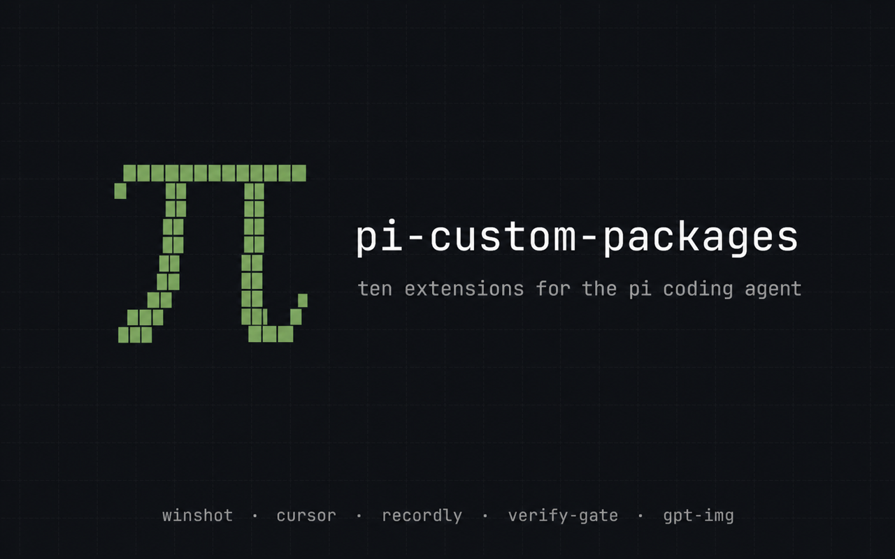

# pi-custom-packages



Eleven small extensions for the [pi coding agent](https://github.com/earendil-works/pi), kept in one repo.

[](./LICENSE)
[](https://github.com/earendil-works/pi)
[](https://nodejs.org)

None of these were planned. Each one started as a session that broke, or a thing
pi could almost do, and the fix turned out small enough to keep around. They live
together because they share conventions and get updated in the same afternoon,
not because they form a system. Take the one you need.

## Install

All eleven, straight from git:

```bash
pi install git:github.com/Blue-B/pi-custom-packages
```

Or one at a time. Nothing here is on npm, and `pi install` will not take a
subdirectory of a repository, so clone first and install from disk:

```bash
git clone https://github.com/Blue-B/pi-custom-packages.git
cd pi-custom-packages

pi install ./packages/pi-verify-gate
pi install ./packages/pi-winshot
```

Then `/reload` in pi.

No package here imports another, so installing one never drags in the rest. A few
do expect something outside this repo (a subagent, a Windows app, an ffmpeg
binary); those are listed with the package and again under
[Requirements](#requirements).

## Packages

### Guards

Sessions rarely fail loudly. They fail as a wrong timeout unit, a model
confidently naming the wrong model, a conclusion nobody checked. These three
watch for that.

| Package | What it does |
|---|---|
| [pi-verify-gate](./packages/pi-verify-gate) | `/verify` (alias `/검증`) pulls the raw tool calls and results of the agent's last turn straight out of the session log, writes them to a file, and has a fresh-context `reviewer` subagent grade the conclusion against them. The agent never picks the target or supplies the evidence. Needs [pi-subagents](https://www.npmjs.com/package/pi-subagents). |
| [pi-bash-watchdog](./packages/pi-bash-watchdog) | pi's bash timeout is in seconds, and models keep passing milliseconds. Rewrites `120000` to `120`, caps foreground dev servers, fills a default when the field is missing. Adds `/bash-watchdog-status`. |
| [pi-model-identity](./packages/pi-model-identity) | A model cannot introspect its own weights, so it repeats whatever name is in the prompt. Injects the live model ID on the first turn, on a model switch, and after compaction. Ships `model_identity_status`. |

### Context hygiene

pi resends the whole conversation every turn, images included. Twenty screenshots
means twenty base64 blobs on turn twenty-one. One of these works on the outbound
payload, the other on the file already written to disk.

| Package | What it does |
|---|---|
| [pi-cap-context-images](./packages/pi-cap-context-images) | Keeps the newest image in the outbound payload and turns the older ones into short text placeholders. pi's `images.autoResize` shrinks images on the way in; nothing in pi prunes what is already sitting in the context. |
| [pi-cap-session-watchdog](./packages/pi-cap-session-watchdog) | The on-disk half: finds session JSONL files that already grew too large while idle, caps their stale images, trims live context. Debounced across processes, prunes its own backups. |

### Windows desktop

pi runs in WSL and cannot see the desktop it is running under. These three give it
eyes, hands, and a recorder, and they are meant to be used together: capture the
screen, act on it, record the result. All three go through `powershell.exe` over
WSL interop and install nothing on the Linux side.

| Package | What it does |
|---|---|
| [pi-winshot](./packages/pi-winshot) | Capture a screen, a region, a monitor, or one window even when five terminals sit on top of it. Then crop, resize, and mask the parts that should not reach the model. |
| [pi-cursor](./packages/pi-cursor) | Focus a window, move the cursor with easing that looks human on a recording, click, type. Plain PowerShell, no AutoHotkey. |
| [pi-recordly](./packages/pi-recordly) | Start and stop [Recordly](https://recordly.dev) recordings, target one window, read status. |

### Everything else

| Package | What it does |
|---|---|
| [pi-gpt-img](./packages/pi-gpt-img) | A `gpt_img` tool for text-to-image and image-to-image on gpt-image-2, reusing the ChatGPT/Codex OAuth token pi already holds. |
| [pi-herdr-ask-blocked](./packages/pi-herdr-ask-blocked) | [herdr](https://herdr.dev)'s sidebar shows a pane as working the entire time pi is actually waiting on an `ask_user_question` answer. This emits the blocked event herdr's own integration already listens for. |
| [pi-codex-accounts](./packages/pi-codex-accounts) | Codex multi-account: auto-rotates on `429/quota` across `openai-codex` accounts, shows `5h/7d` bars with absolute reset dates (`8/28 05:07`) and current-account highlight. `/codex-accounts` widget hides on close. |

## Platform support

Four of the eleven need nothing beyond pi itself: bash-watchdog,
cap-context-images, cap-session-watchdog, and model-identity. The
other seven each want something specific.

| Needs | Packages |
|---|---|
| Windows 10/11 with WSL2 and interop | winshot, cursor, recordly |
| ffmpeg on `PATH` | winshot, gpt-img |
| [pi-subagents](https://www.npmjs.com/package/pi-subagents), for its `reviewer` agent | verify-gate |
| [herdr](https://herdr.dev) with `herdr integration install pi` | herdr-ask-blocked |
| A ChatGPT or Codex OAuth login | gpt-img, codex-accounts |

On a native Linux machine the three Windows packages load without error and then
do nothing, which is the intended behaviour rather than a guard worth writing.

## Requirements

pi, tested on 0.84, and Node.js 18 or newer. Anything else is per package and
listed above; each package README repeats its own.

## Contributing

Issues and pull requests are welcome. These grew out of one person's setup, so a
package that half-works for you is worth reporting: the odds are good that the
broken assumption is mine and not pi's.

## License

MIT © [Blue-B](https://github.com/Blue-B)
